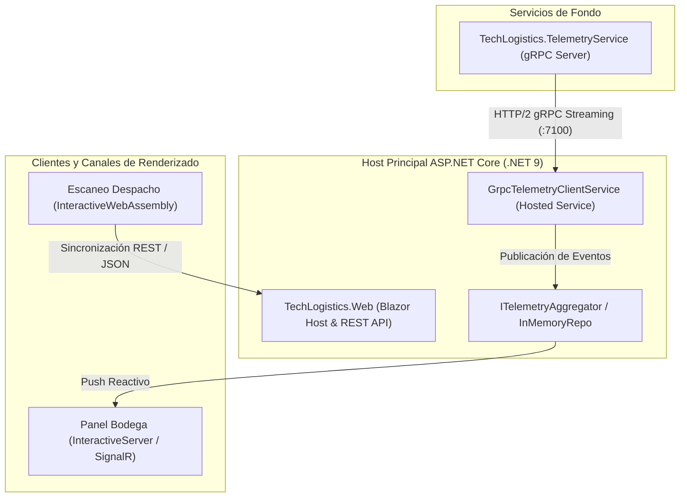

# TechLogistics S.A. — Portal Interactivo de Gestión Logística
### Documento de Arquitectura y Especificación de Software

[](https://dotnet.microsoft.com/)
[](https://dotnet.microsoft.com/apps/aspnet/web-apps/blazor)
[](https://grpc.io/)
[](#5-estrategia-y-reporte-de-pruebas-ieee-829)
[](#)

---

## Resumen Ejecutivo (Abstract)

El proyecto **TechLogistics S.A.** es un sistema integral de supervisión de existencias, control de bodegas y registro de despachos en campo para empresas de distribución logística. La plataforma ha sido diseñada bajo una arquitectura moderna de **ASP.NET Core Blazor Web App** en **.NET 9**, implementando **Render Modes intercalados** (*InteractiveServer* e *InteractiveWebAssembly*) combinados con ingesta de telemetría reactiva en tiempo real a través del protocolo **gRPC sobre HTTP/2**.

---

## 1. Introducción y Alcance

### 1.1 Propósito
Proveer a la organización una solución de software escalable y distribuida capaz de consolidar el inventario de múltiples centros de distribución con latencias ultra bajas, asegurando a la vez operatividad de campo sin interrupciones ante pérdidas eventuales de conectividad de red.

### 1.2 Alcance del Sistema
* **Monitoreo Centralizado de Inventarios:** Visualización analítica de existencias críticas, óptimas y agotadas en múltiples sedes territoriales con sincronización en vivo.
* **Telemetría de Alta Frecuencia:** Emisión y agregación de eventos de inventario mediante streaming bidireccional gRPC.
* **Gestión de Despachos Desconectada (Offline-First):** Registro de salidas de mercancía en dispositivos de agentes en campo con persistencia en cliente (IndexedDB / almacenamiento local) y cola de sincronización diferida.
* **Control de Acceso Basado en Roles (RBAC):** Autenticación y autorización estricta mediante Cookies de sesión y claims criptográficos para los perfiles operativos.

### 1.3 Perfiles de Usuario y Matriz de Roles

| Rol de Usuario | Identificador | Propósito Operativo | Entorno de Ejecución |
| :--- | :--- | :--- | :--- |
| **Gerente de Bodega** | `GerenteBodega` | Supervisión analítica de inventario, stock crítico y métricas en vivo. | Servidor (`InteractiveServer` / SignalR) |
| **Agente de Campo** | `AgenteCampo` | Escaneo y despacho de productos en centros logísticos con o sin conexión. | Cliente (`InteractiveWebAssembly` / WASM) |

---

## 2. Arquitectura del Sistema y Diseño de Software

### 2.1 Modelo Arquitectónico
La solución implementa una topología desacoplada orientada a servicios:



### 2.2 Descomposición Modular de la Solución

```
TechLogistics.sln
├── protos/
│   └── telemetry.proto                # Contrato gRPC compartido (Protocol Buffers v3)
├── src/
│   ├── TechLogistics.Web/             # Host Blazor Web App, endpoints REST y autenticación
│   ├── TechLogistics.Client/          # Cliente Blazor WebAssembly para agentes de campo
│   ├── TechLogistics.Components/      # Razor Class Library (RCL) de componentes de UI
│   ├── TechLogistics.Shared/          # Modelos de dominio, enums, contratos y DTOs
│   └── TechLogistics.TelemetryService/# Servidor autónomo de streaming gRPC de telemetría
└── tests/
    └── TechLogistics.Tests/           # Suite de pruebas automatizadas xUnit y bUnit
```

### 2.3 Matriz de Componentes de Interfaz de Usuario

| Componente | Proyecto | Render Mode | Responsabilidad |
| :--- | :--- | :--- | :--- |
| **`WarehouseMonitor.razor`** | `TechLogistics.Web` | `InteractiveServer` | Panel de control con 4 KPIs en vivo y filtrado reactivo de inventario. |
| **`DispatchScanner.razor`** | `TechLogistics.Client` | `InteractiveWebAssembly` | Formulario de despacho rápido y cola de persistencia local. |
| **`PaginatedTable.razor`** | `TechLogistics.Components` | Universal (RCL) | Componente genérico (`TItem`) de tabla paginada con eventos. |
| **`InventoryStatusBadge.razor`** | `TechLogistics.Components` | Universal (RCL) | Indicador visual de stock con animaciones de pulso semántico. |
| **`DispatchForm.razor`** | `TechLogistics.Components` | Universal (RCL) | Formulario fuertemente tipado con validación DataAnnotations. |
| **`Login.razor`** | `TechLogistics.Web` | SSR (Static) | Punto de autenticación segura con autorrellenado rápido para demostraciones. |

---

## 3. Requisitos del Sistema y Dependencias

### 3.1 Entorno de Ejecución
* **SDK:** [.NET 9.0 SDK](https://dotnet.microsoft.com/download) (versión `9.0.318` o superior).
* **Sistema Operativo:** Multiplataforma (Linux, macOS, Windows 10/11).
* **Navegador Web:** Compatible con WebAssembly y WebSockets (Chrome, Firefox, Edge, Safari).

### 3.2 Dependencias Principales
* `Grpc.AspNetCore` & `Grpc.Net.Client` (v2.60+): Comunicación de telemetría binaria.
* `Microsoft.AspNetCore.Components.WebAssembly.Server`: Soporte para hosting dual WASM/Servidor.
* `bUnit` & `xUnit`: Pruebas unitarias de componentes y servicios.

---

## 4. Guía de Compilación, Despliegue y Ejecución

### 4.1 Compilación de la Solución
Desde la terminal en el directorio raíz:

```bash
# Restauración de dependencias y paquetes NuGet
dotnet restore

# Compilación completa en modo Debug
dotnet build

# Compilación optimizada para producción
dotnet build -c Release
```

### 4.2 Ejecución del Sistema

#### **Opción A: Ejecución Simultánea Automatizada (Recomendada)**
El repositorio incluye un script orquestador (`run.sh`) con control de procesos y captura de señales `SIGINT`/`EXIT`:

```bash
./run.sh
```

#### **Opción B: Ejecución Manual en Terminales Separadas**
1. **Terminal 1 — Servidor de Telemetría (gRPC):**
   ```bash
   dotnet run --project src/TechLogistics.TelemetryService/TechLogistics.TelemetryService.csproj
   ```
2. **Terminal 2 — Host Web Principal (Blazor):**
   ```bash
   dotnet run --project src/TechLogistics.Web/TechLogistics.Web.csproj
   ```

---

## 5. Accesos, Endpoints y Credenciales de Prueba

Una vez iniciados los servicios, la plataforma se encuentra disponible en:
* **Portal Web Principal:** `https://localhost:60240` (o `http://localhost:60243`)
* **Endpoint de Telemetría gRPC:** `https://localhost:7100`

### Matriz de Cuentas de Demostración

| Usuario | Contraseña | Rol Asignado | Rutas Autorizadas |
| :--- | :--- | :--- | :--- |
| `gerente1` | `Gerente#2026` | `GerenteBodega` | `/`, `/bodega/monitoreo` |
| `agente1` | `Agente#2026` | `AgenteCampo` | `/`, `/despacho/escaneo` |

---

## 6. Estrategia y Reporte de Pruebas

El proyecto cuenta con una cobertura integral de pruebas unitarias de backend y pruebas de renderizado de componentes Razor mediante **bUnit**.

### Ejecución de Pruebas y Cobertura
```bash
dotnet test --collect:"XPlat Code Coverage"
```

### Resumen de Resultados de Validación

```text
Test run for: tests/TechLogistics.Tests/bin/Debug/net9.0/TechLogistics.Tests.dll (.NETCoreApp,Version=v9.0)
Total Tests : 30
Passed      : 30 (100%)
Failed      : 0
Skipped     : 0
Duration    : 478 ms
```

---

## 7. Registro de Decisiones de Ingeniería (Architecture Decision Records - ADR)

* **ADR-001 (Render Modes Intercalados):** Se optó por una arquitectura híbrida donde las vistas gerenciales aprovechan el bajo consumo de recursos del cliente mediante `InteractiveServer`, mientras que las vistas operativas de campo residen en `InteractiveWebAssembly` para garantizar autonomía funcional sin internet.
* **ADR-002 (Resolución TLS en Desarrollo Linux):** Se integró en `GrpcTelemetryClientService` un manejador condicional `DangerousAcceptAnyServerCertificateValidator` restringido estrictamente al entorno `Development`, permitiendo establecer conexiones seguras HTTP/2 sobre certificados locales autofirmados sin requerir elevación de privilegios en el almacén de certificados del sistema operativo.
* **ADR-003 (Design System Corporativo):** Implementación de una interfaz con tokens CSS (`:root`), tipografías de alta densidad (*Plus Jakarta Sans* e *Inter*), tarjetas de KPIs en vivo y estados visuales normalizados sin dependencias externas de frameworks pesados.
